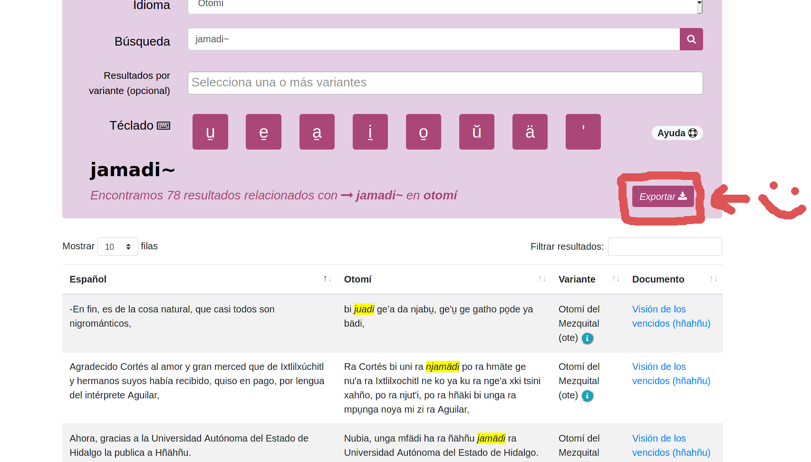

# Esquite: framework para administrar corpus paralelos 🌽

[](https://esquite.readthedocs.io/es/latest/?badge=latest)
[](https://github.com/ElotlMX/Esquite/blob/master/LICENSE)

## Acerca de Esquite

Esquite es un *framework* que está destinado a personas que poseen corpus
paralelos (textos bilingües) y que deseen obtener un sistema web que les permita
subir documentos, administrarlos y realizar búsquedas basadas en palabras
y frases en las dos lenguas.

### Características

* Realizar búsquedas avanzadas atreves de tus corpus paralelos gracias al motor
	de búsquedas de [*Elasticsearch*](https://www.elastic.co/es/)
* Gestionar tus documento por medio de su administrador de corpus
* Personalización de la interfaz web
	* Colores
	* Teclado con caracteres especiales (útil para lenguas minorizadas)
	* Agregar `html` con información personalizada a las vistas: **Ayuda**, **Acerca del Corpus**,
		**Links**, etc.
* Nuevas características en desarrollo


### Ejemplo: [Tsunkua Corpus Paralelo Español-Otomí](https://tsunkua.elotl.mx/)

<p align="center">
	
	
</p>

## Documentación

Para una [guía de instalación completa](https://esquite.readthedocs.io/es/latest/install.html), [tutoriales](https://esquite.readthedocs.io/es/latest/tutorials.html) y una explicación de la estructura del proyecto se puede revisar nuestra [documentación](https://esquite.readthedocs.io/es/latest/).

## Contacto

¿Eres hablante/estudioso de una lengua minorizada y te gustaría poner tu corpus
paralelo en línea? Contactamos: *contacto at elotl.mx*

## Dependencias

* [Elasticsearch 8.15](www.elastic.co/guide/en/elasticsearch/reference/8.15/elasticsearch-intro-what-is-es.html)
* `python 3.12` o mayor
* `uv`
* `git`

## Installation

1. Instala y ejecuta `elasticsearch`

> [!NOTE]
> Revisa la documentación oficial en la página de [Elasticsearch](https://www.elastic.co/guide/en/elasticsearch/reference/8.15/install-elasticsearch.html) para completar este paso dependiendo de tu Sistema Operativo. Alternativamente puedes usar [docker](https://www.elastic.co/guide/en/elasticsearch/reference/8.15/docker.html) para una instalación más sencilla.

> [!TIP]
> Quizá quieras deshabilitar las características de seguridad default de elasticsearch si estas corriendolo en tu red local o si solo estas realizando pruebas con esquite. Puede modificar el archivo en la ruta `/usr/share/elasticsearch/config/elasticsearch.yaml`.

2. [Instala](https://docs.astral.sh/uv/#installation) `uv` en tu sistema

	```shell
	$ curl -LsSf https://astral.sh/uv/install.sh | sh
	```

3. Clona este repositorio de código

	```shell
	$ git clone https://github.com/ElotlMX/Esquite --depth=1
	```

4. Instala dependencias
   
   Cambiate al directorio del proyecto e instala las dependencias. Activa el entorno virutal del proyecto

	```shell
	$ cd Esquite
	$ uv sync --no-dev 
    $ source .venv/bin/activate
	```

5. Lanza el wizard de instalación e introduce la información requerida

	```shell
	(esquite)$ python wizard.py
	```

> [!NOTE]
> El wizard creará un índice de `elasticsearch` automáticamente

> [!TIP]
> Alternativamente puedes correr el comando `curl` que está a continuación para crear el índice manualmente antes de correr el wizard. Las configuraciones por defecto pueden encontrarse en el archivo `elastic-config.json`.


```shell
$ curl -X PUT -H "Content-Type: application/json" -d @elastic-config.json localhost:9200/<index-name>
```

6. Aplica las migraciones de `django`

	```shell
	(esquite)$ python manage.py migrate
	```

7. Corre `django` en segundo plano

	```shell
	(esquite)$ python manage.py runserver 0.0.0.0:8000 &
	```

8. Ve a la dirección `http://localhost:8000/` en tu navegador par ver Esquite corriendo :)

> [!NOTE]
> Para una guia detalla de puesta en producción por favor contactanos.

## Docker image alternative: `Esquite-Docker`

Alternativamente, es posible usar Esquite y ponerlo en producción de una forma más facil usando nuestra imagen oficial de docker.

La documentación detallada esta disponible en los siguientes links:

- Esquite-Docker Github : https://github.com/ElotlMX/Esquite-docker
- Esquite-Docker Dockerhub : https://hub.docker.com/r/elotlmx/esquite

### Colaboradoras

* **Leadership:** Xim ([@XimGuitierrez](https://twitter.com/XimGutierrez)) - *xim at unam.mx*
* **Mantainer:** Diego B. ([@umoqnier](https://twitter.com/umoqnier)) - *diegobarriga at protonmail.com*
* **DevOps**: Javier ([@jusafing](https://twitter.com/jusafing)) - *jusafing@jusanet.org*

### Comunidad

* Twitter: [@elotlmx](https://twitter.com/elotlmx)
* Sitio: [https://elotl.mx/](https://elotl.mx)
* Email: *contacto at elotl.mx*
