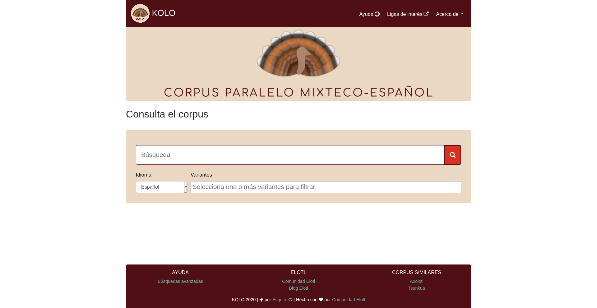

.. Corpus Paralelo Backend documentation master file, created by
   sphinx-quickstart on Fri Apr 10 18:41:31 2020.
   You can adapt this file completely to your liking, but it should at least
   contain the root `toctree` directive.

Bienvenidæ a la documentación de Esquite 🌽
===========================================

Puedes comenzar con la :ref:`instalation` y después
seguir alguno de nuestros :ref:`tutorials` para que configures y
personalices tu propia instancia de Esquite.

Adicionalmente esta disponible nuestra
`imagen oficial de Docker <https://github.com/ElotlMX/Esquite-docker>`_ para el *framework*.

`Documentación de la API <api.html>`_
^^^^^^^^^^^^^^^^^^^^^^^^^^^^^^^^^^^^^

Información sobre los *endpoints* de la API de Esquite y cómo utilizarlos.

¿Qué es Esquite?
^^^^^^^^^^^^^^^^

Esquite es un *framework* de software libre destinado a personas que poseen
corpus paralelos (textos bilingües) y que desean tener un sistema web que les
permita subir, administrar realizar búsquedas de palabras o frases en sus
corpus.

Este software funciona con ``django`` para el *backend* y utiliza
``elasticsearch`` como motor de búsquedas y gestión de documentos. Ejemplos de
instancias del *framework* son las siguientes:

* `TSU̱NKUA <https://tsunkua.elotl.mx/>`_: corpus paralelo con documentos bilingües digitalizados y alineados de distintas variantes del otomí.

.. image:: static/img/tsunkua.png
   :target: https://tsunkua.elotl.mx/
   :alt: Corpus paralelo TSU̱NKUA

* `KOLO <https://kolo.elotl.mx/>`_: corpus paralelo con documentos bilingües digitalizados y alineados de las lenguas mixtekas.

Tabla de contenidos
-------------------

.. toctree::
   :maxdepth: 2

   install
   tutorials
   API Docs <api.html#http://>
   esquite
   searcher
   corpus_admin
   wizard
   estructura

Indices
=======

* :ref:`genindex`
* :ref:`modindex`
* :ref:`search`
