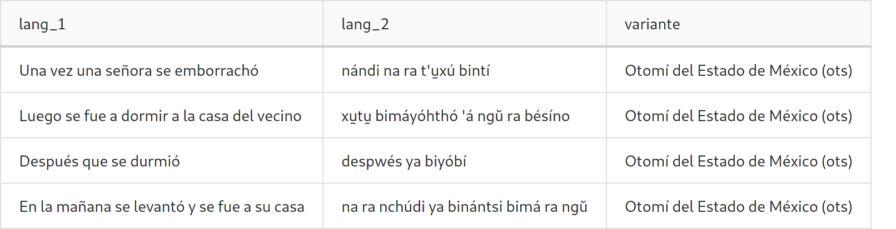

Tutoriales
==========

Subida de documentos
--------------------

La aplicación provee una interface interna de *administración del corpus* que
puede encontrarse en la url ``https://micorpus.com/corpus-admin/``.
Si se quiere subir material al corpus deberá ser en formato ``.csv``
(**separado por comas**).

Es **indispensable** que exista la cabecera ya que la primer línea
del archivo se **ignora** por defecto. Actualmente se tiene la siguiente
convención para la subida de nuevos documentos

Primera columna la lengua l1 (en este ejemplo español), segunda columna la
lengua l2 (en este ejemplo otomí) y en la última columna la variante. Además,
cada documento deberá tener asociado un archivo ``.PDF`` con fines ilustrativos
para lxs usuarixs.

.. note::
  En caso de que la variante tenga ISO se requiere que venga entre
  paréntesis al final del nombre de la variante como se muestra en la tabla
  anterior.

  Si no existe variante para el documento dicha columna **deberá** existir pero
  estará vacía.

Agregar teclado personalizado
-----------------------------

El corpus permite agregar teclas personalizadas para la lenguas con 
caracteres que no estén en el teclado o que sean difíciles de poner. Para
agregar teclas personalizadas se debe modificar la variable ``KEYBOARD`` del
archivo ``env.yaml`` agregando cada tecla en un renglón. A continuación se
muestra un ejemplo

.. note::

  Se debe agregar el guión antes de cada letra para que se pueda interpretar
  como una lista de caractéres.

.. code-block:: yaml

        KEYBOARD:
        - u̱
        - e̱
        - a̱
        - i̱
        - o̱
        - ŭ
        - ä
        - "'"

Agregar datos de contacto
-------------------------

Se pueden agregar las redes sociales y datos de contacto de la organización.
Dicho datos aparecen en la vista de ``participantes``. Para agregar estos datos
se debe modificar la variable ``SOCIAL``. Esta variable tiene un formato de 
diccionario.

.. code-block:: yaml

        SOCIAL:
          site: 'https://mi_sitio.mx/'
          blog: 'https://mi_sitio.mx/blog/'
          email: 'contacto@mi_sitio.mx'
          facebook: 'https://facebook.com/mi_sitio'
          github: 'https://github.com/mi_sitio'
          twitter: 'https://twitter.com/mi_sitio'

Modificación del banner
-----------------------

El banner por defecto puede ser remplazado modificando el archivo
que se encuentra en la ruta ``static/img/banner.png/``. El archivo **debe**
llamarse ``banner.png``

.. _elastic-configuration:

Configuración del índice de elasticsearch
-----------------------------------------

Esta configuración es la utilizada actualmente en el índice de elasticsearch
para hacer el preprocesamiento del español tomando en cuenta las *stopwords*.

Index settings
^^^^^^^^^^^^^^

.. code-block:: json

  {
    "number_of_shards": 1,
    "analysis": {
        "filter": {
          "spanish_stop": {
            "type":       "stop",
            "stopwords":  "_none_"
          },
          "spanish_stemmer": {
            "type": "stemmer",
            "language": "light_spanish"
          }
        },
        "analyzer": {
          "rebuilt_spanish": {
            "tokenizer":  "standard",
            "filter": [
              "lowercase",
              "spanish_stop",
              "spanish_stemmer"
            ]
          }
        }
      }
  }

Mapping
^^^^^^^

.. code-block:: json

  {
    "document_file": {
      "type": "keyword"
    },
    "document_id": {
      "type": "keyword"
    },
    "document_name": {
      "type": "keyword"
    },
    "lang_1": {
      "type": "text",
      "analyzer":"rebuilt_spanish"
    },
    "lang_2": {
      "type": "text"
    },
    "variante": {
      "type": "keyword"
    }
  }

Ingest Pipeline
^^^^^^^^^^^^^^^

.. code-block:: json

  {
    "description": "Ingest pipeline created by file structure finder",
    "processors": []
  }
