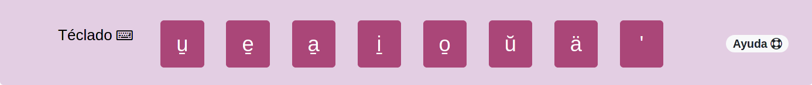
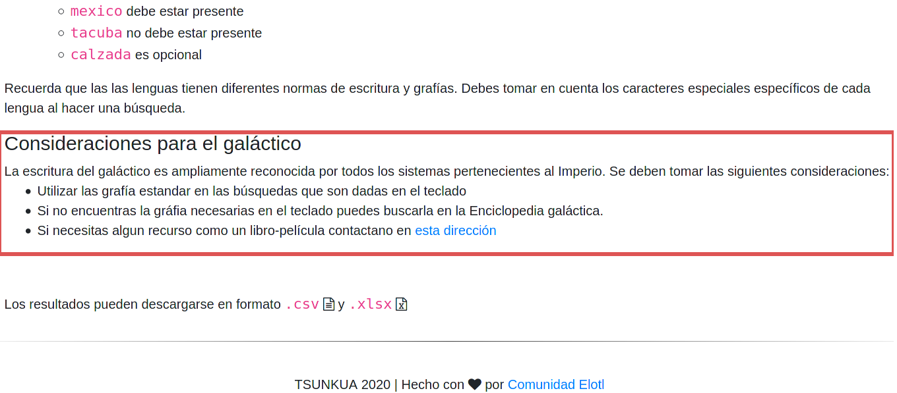
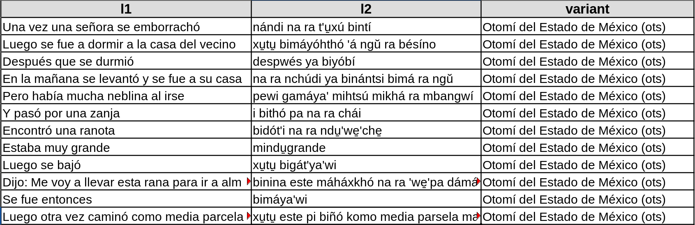

.. _tutorials:

Tutoriales
==========

Personalización
---------------

El archivo ``env.yaml`` contiene la mayoria de elementos que pueden modificarse
para personalizar tu instancia de Esquite. Además en los archivos
`templates/user/*.html` puedes agregar texto en ``html`` que se incrustará en
las vistas de la interfaz web.

.. _colors:

Colores
```````

La personalización de colores está limitada a los fondos, texto y bordes de
diversos elementos como el navbar, footer, botones, etc. Modificando la variable
``COLORS`` que tiene formato de diccionario se pueden alterar los colores de las
vistas por elemento ``HTML``. La variable tiene el siguiente formato:

.. code-block:: yaml

    COLORS:
      background:
        btnhover: '#bf6492'
        button: '#aa4678'
        footer: '#e2e4f2'
        form: '#e3cee3'
        highlight: '#aa4678'
        nav: '#e3cee3'
      border:
        button: '#aa4678'
        input: '#aa4678'
      text:
        bold: '#aa4678'
        btnhover: 'white'
        button: '#e2e4f2'
        footer: '#20124d'
        form: '#20124d'
        highlight: 'white'
        hoverlinks: '#bb6a93'
        links: '#aa4678'
        nav: 'black'
        navactive: '#aa4678'
        navhover: '#bb6a93'
        result: '#20124d'

Se puede utilizar formato hexadecimal (``#fffffff``) o el nombre en inglés del
color si es un `color soportado <https://www.w3schools.com/cssref/css_colors.asp>`_
por ``css``.

.. _keyboard:

Teclado
```````

El corpus permite agregar teclas personalizadas para la lengua *l2* con
caracteres que no estén en el teclado físico o que sean difíciles de obtener.
Para agregar teclas personalizadas se debe modificar la variable ``KEYBOARD``
del archivo ``env.yaml`` agregando cada tecla en un renglón. A continuación se
muestra un ejemplo

.. code-block:: yaml

        KEYBOARD:
        - u̱
        - e̱
        - a̱
        - i̱
        - o̱
        - ŭ
        - ä
        - "'"



.. note::

  Se debe agregar el guión antes de cada letra para que se pueda interpretar
  como una lista de caractéres. Tambien se puede usar una sintaxis de lista
  tipo python como ``KEYBOARD: [u̱, e̱, a̱, i̱, o̱, ŭ, ä, "'"]``.

.. _contact:

Datos de contacto
`````````````````

Se pueden agregar las redes sociales, datos de contacto de la organización.
Además, se pueden agregar ligas a corpus similares.
Dicho datos aparecen en la vista de ``Ligas de ínteres`` y en el *footer* de la
interfaz web. Para agregar estos datos se debe modificar la variable ``LINKS``.
Esta variable tiene un formato de diccionario.

.. code-block:: yaml

    LINKS:
        social:
          site: 'https://mi_sitio.mx/'
          blog: 'https://mi_sitio.mx/blog/'
          email: 'contacto@mi_sitio.mx'
          facebook: 'https://facebook.com/mi_sitio'
          github: 'https://github.com/mi_sitio'
          twitter: 'https://twitter.com/mi_sitio'
        corpora:
          default: "https://www.default-corpus.com/search"

Colaboradoræs
`````````````

Si el desarrollo del proyecto que estas elaborando tiene más personas
involucradas es posible modificar la variable ``COLABS`` para agregar los
nombres de estas personas. Dichos nombres se desplegaran en la vista de
``participantes``.

.. code-block:: yaml

  COLABS:
    - Hari Seldon
    - Salvon Hardin
    - Hober Mallow
    - Bayta Darrell
    - Arkady Darrell

Modificación del banner
```````````````````````

El banner por defecto puede ser remplazado modificando el archivo
que se encuentra en la ruta ``static/img/banner.png``. El archivo **debe**
llamarse ``banner.png``. Se recomienda utilizar una imagen de ``1260 x 270
pixeles``.

Vistas
``````

Es posible extender las vistas de ``Ayuda``, ``Ligas de
interés``, ``Acerca del Corpus`` y ``Participantes`` con
información específica del proyecto.

Para agregar información a las vistas se deben modificar los archivos que se
encuentran en la ruta ``tamplates/user/``. Cada archivo hace referencia a la
vista que se modificará. El formato de los archivos es ``html``.

Por ejemplo, si deseas extender la sección de ayuda puedes modificar el
archivo ``templates/user/help-user.html``. Si agregas el siguiente código
``html`` se obtiene el resultado de la imagen.

.. code-block:: html

  <h4>Consideraciones para el galáctico</h4>
  La escritura del galáctico es ampliamente reconocida por todos los sistemas pertenecientes al Imperio. Se deben tomar las siguientes consideraciones:

  <ul>
    <li>Utilizar las grafía estandar en las búsquedas que son dadas en el teclado</li>
    <li>Si no encuentras la gráfia necesarias en el teclado puedes buscarla en la Enciclopedia galáctica.</li>
    <li>Si necesitas algun recurso como un libro-película contactano en <a href="http://www.imperio.com" target="_blank">esta dirección</a></li>
  </ul>




Administración del corpus
-------------------------

La aplicación provee una interfase interna de *administración del corpus*.
Para acceder al administrador se debe introducir la *URL* directamente en
el navegador y es la siguiente ``https://<micorpus.com>/corpus-admin/``,
dónde ``<micorpus.com>`` dependerá de las configuraciones personales de
dominio.

.. note::

  Si está en un entorno local ``<micorpus.com>`` debería ser sustituido
  por ``localhost:8000`` con lo que la *URL* será ``http://localhost:8000/corpus_admin/``

Subida de documentos
````````````````````

Si se quiere subir material al corpus deberá ser en formato ``.csv``
(**separado por comas**).

Es **indispensable** que exista la cabecera ya que con base en el nombre de las
columnas se realizarán las configuraciones automaticas y el poblado de la base
de datos. Actualmente se tiene la siguiente convención para la subida de nuevos
documentos:



Una columna con el nombre **l1** (en este ejemplo español), otra columna con
el nombre **l2** (en este ejemplo otomí) y en la última columna con el nombre
**variant** (en caso de no existir variante la columna debe existir con el
nombre indicado pero vacía). Además, cada documento deberá tener asociado un
archivo ``.PDF`` con fines ilustrativos para læs usuariæs.

.. tip::
    Se pueden agregar más columnas. Al subir el primer documento se notificará
    que existen campos adicionales a los estándar (l1, l2, variant). Basta con
    identificar los campos como texto o palabras clave. **Agregar los campos extra
    es opcional**.

    .. image:: static/img/extra_fields_config.png

.. note::
  En caso de que la variante tenga ISO se requiere que venga entre
  paréntesis al final del nombre de la variante como se muestra en la tabla
  anterior.

  Si no existe variante para el documento dicha columna **deberá** existir pero
  estará vacía.


Configuración
-------------

.. _elastic-configuration:

Creación del índice de elasticsearch
````````````````````````````````````

El *framework* requiere de un índice de ``elasticsearch`` configurado. Para crear
el índice es necesario que una instancia de ``elasticsearch`` este instalada y
ejecutandose. El asistente :func:`wizard` se encarga de crear un índice con
configuraciones por defecto :ref:`index-config-file`. Adicionalemente, se puede
utilizar el comando ``curl`` como se muestra a continuación:

.. code-block:: shell

  $ curl -X PUT -H "Content-Type: application/json" -d @elastic-config.json localhost:9200/<nombre-de-tu-indice>

La configuración por defecto esta optimizada para que a la lengua *l1* se le
aplique un preprocesamiento asumiendo que es el idioma español para que las
búsquedas tomen en cuenta las *stopwords*.

.. _index-config-file:

``elastic-config.json``
^^^^^^^^^^^^^^^^^^^^^^^

.. code-block:: json

  {
    "settings": {
      "index": {
        "number_of_shards": 1,
        "analysis": {
          "filter": {
            "spanish_stop": {
              "type":       "stop",
              "stopwords":  "_none_"
             },
            "spanish_stemmer": {
              "type": "stemmer",
              "language": "light_spanish"
            }
          },
          "analyzer": {
            "rebuild_spanish": {
              "tokenizer":  "standard",
              "filter": [
                "lowercase",
                "spanish_stop",
                "spanish_stemmer"
              ]
            }
          }
        }
      }
    },
    "mappings": {
      "properties": {
        "pdf_file": {
          "type": "keyword"
        },
        "document_id": {
          "type": "keyword"
        },
        "document_name": {
          "type": "keyword"
        },
        "l1": {
          "type": "text",
          "analyzer":"rebuild_spanish"
        },
        "l2": {
          "type": "text"
        },
        "variant": {
          "type": "keyword"
        }
      }
    }
  }
